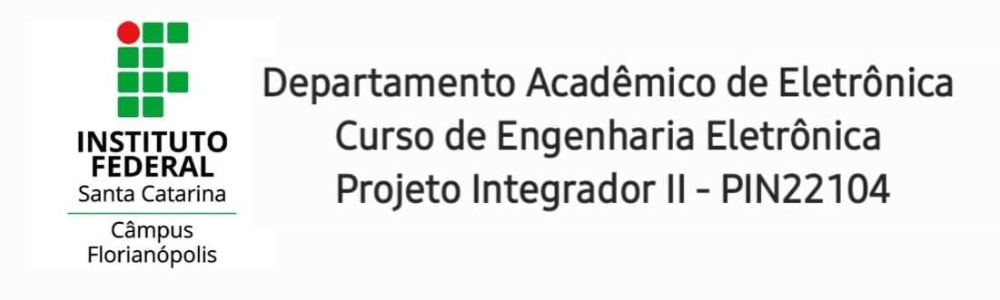
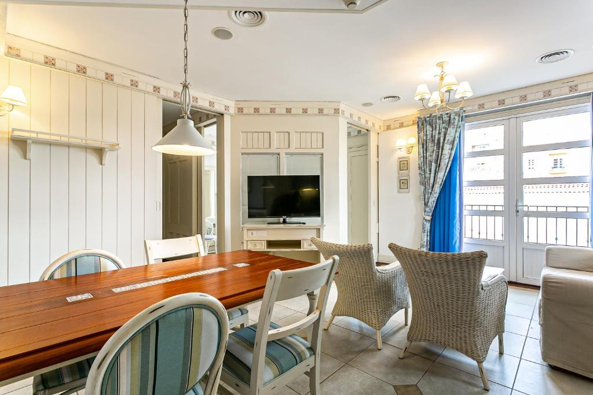

---
# PROJETO INTEGRADOR II
##### Repositório destinado ao Projeto Integrador 2 da 4º fase de Engenharia Eletrônica no IFSC - Câmpus Florianópolis
---

* [Introdução à Domótica](./README.md)
* [Concepção do Projeto](./concepcao.md)
* [Referências](./referencias.md)

# DOMÓTICA - Automação Residencial

  Para começar com a contextualização do tema, analisaremos a palavra **Domótica**. Este termo surge da junção da palavra *Domus*, que significa "casa", com a palavra *Robótica*, que significa fazer algo automático. Ou seja, uma casa que seja capaz de realizar ações automatizadas.

  A Domótica aborda sobre o uso de um sistema dinâmico que junta várias tecnologias parar fazer o controle de uso desses dispositivos conectados, de maneira que nós, seres humanos, realize o mínimo de esforço nas atividades diárias, domésticas e até mesmo empresariais.

* Como a Automação Residencial pode ajudar a minimizar esses esforços do dia a dia?
> 
> * Com o conceito de Dómotica, podemos criar um sistema que controle a temperatura ambiente da casa a partir do acesso remoto feito pelo smartphone, ou, programar em um determinado horário que a temperatura ambiente fique mais fria ou quente de acordo com o que proprietário da casa desejar.

> * Podemos programar as luzes dos cômodos para que acenda com um toque pelo celular, ou até mesmo que desligue automaticamente em um determinado horário.

> * Podemos instalar um sensor de calor nos cômodos da casa e, caso o sensor determine que não há ninguem no apartamento e esteja ligado um aparelho consumindo muita energia, como por exemplo um ar condicionado, o sistema desligará este aparelho eletrônico, economizando assim, na conta de luz com esse sistema inteligente de gastos.
##### Esses são apenas alguns exemplos do que pode ser feito com os conceitos de Dómotica, automação residencial.
  
As aplicações de Automação são infinitas. *"Se podemos imaginar, pode ser feito."*
Se pensarmos de maneira mais ampla, podemos ver que a Dómotica é muito aplicável em outras áreas e também, para diversas pessoas necessitadas. Como por exemplo, pessoas com deficiência física. Fazendo com que ela ganhe independência e que facilite sua vida cotidiana através do uso da tecnologia.

Assim como o uso da tecnologia é indispensável para as pessoas com deficiência, não é diferente para os idosos. Sabemos que para alguns idosos, o esforço de levantar da cama e andar até o interruptor é gigantesco, podendo ser até grave em alguns casos, e para facilitar este fim, com a Domótica isso é resolvido. Basta criamos um sistema de voz que controle os dispositivos do apartamento ou casa. Quando este idoso disser para acender a luz da sala, até mesmo a TV ou outro aparelho. Ligará tudo que for mandado com o mínimo de esforço possível e isso pode ser feito até deitado. Trazendo uma acomodação muito melhor e mais segura para o idoso.  

Na empresa em que trabalho, a **Seazone**, utilizamos o conceito de Automação Residencial para solucionar alguns problemas enfrentados pelos donos de apartamentos, resorts e residências. O produto se chama **Sésamo** e ele é responsável por automatizar a abertura e fechamento das portas dos prédios, resorts e residências. Facilitando o Check-in e Check-out de quem alugou aquele apartamento.

Podemos concluir que a **Dómotica** é extremamente necessário no dia a dia dos seres humanos, tanto para soluções de problemas, quanto para facilitar uma determinada tarefa cotidiana.

# Referências

SISLITE. **O que é Domótica?**. 2021. Disponível em: http://www.sislite.pt/domus.htm. Acesso em: 22 maio 2021.

SEAZONE. **Sobre a empresa**. 2019. Disponível em: https://www.seazone.com.br/sobre-a-empresa/. Acesso em: 23 maio 2021.

TEZA, V. R. **Alguns Aspectos sobre a Automação Residencial - Domótica**. Dissertação (Mestrado) - Universidade Federal de Santa Catarina, 2002. Disponível em: https://repositorio.ufsc.br/bitstream/handle/123456789/83015/212312.pdf?sequence=1&isAllowed=y. Acesso em: 21 maio 2021.

---
#### Propriedade de Gabriel Peres
##### Aluno de Engenharia Eletrônica cursando a 4º Fase no IFSC - Câmpus Florianópolis

<a href="https://github.com/imperes">
 
  
 <b>Gabriel Peres</b></a> <a href="https://github.com/imperes" title="Rocketseat">🚀</a>

Feito com ❤️ por Gabriel Peres 📱 Entre em contato!

 

---
