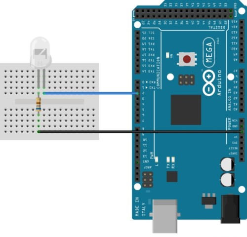

# Teste dos LEDs

Acender os LEDs é o primeiro passo para entender o funcionamento do arduino e funções básicas como pinMode e digitalWrite. 

# Montagem

Para acender LEDs utilizando o arduíno é necessário utilizar resistores para compensar a tensão e corrente, e assim, evitar danificar os LEDs. O resistor utilizado foi de 330 ohms, mas podem ser utilizados outros valores desde que mantenham a corrente e tensão abaixo dos valores máximos suportados pelo LED.

# Código

~~~C
#define LED 2                                 // Pino do LED

/*A função setup é utilizada para inicialização é executada apenas uma vez*/ 
void setup() 
{
  pinMode(LED, OUTPUT);                       // configura o pino do LED como saída 

}

/*A função loop é executada repetidamente*/ 
void loop() 
{
  digitalWrite(LED, HIGH);                     // Acende o LED   
  delay(1000);                                 // Espera 1s  
  digitalWrite(LED, LOW);                      // Apaga o LED
  delay(1000);                                 // Espera 1s
}
~~~
