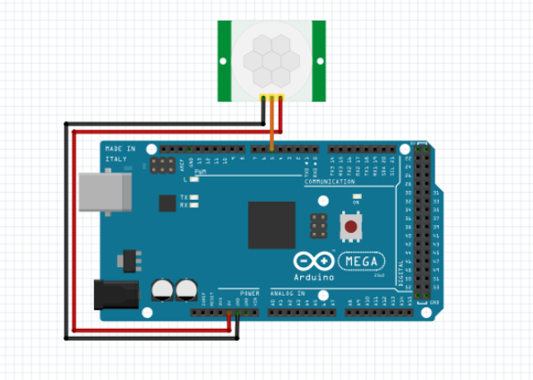
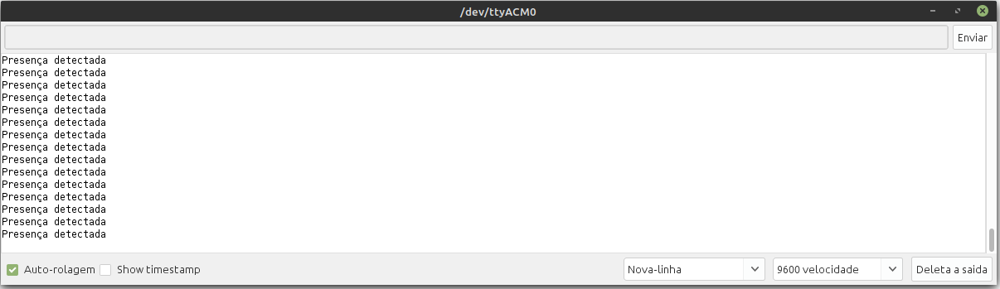

# Teste do Sensor de Presença PIR

O sensor de presença PIR é conectado a um pino digital de entrada, quando é detectada presença o sensor envia para o Arduino nível lógico alto. Portanto, utilizando a função digitalRead() é possível identificar quando há presença e realizar, nesse caso, o envio de uma mensagem "Presença destectada" no Monitor Serial.

### Montagem do circuito

### Código

~~~C
#define PIR    5   //Pino do sensor de presença

void setup()
{

  pinMode(PIR, INPUT); //Configura o pino do PIR como pino de entrada

  Serial.begin(9600); //Inicializa o monitor serial
}

void loop() 
{
  if ((digitalRead (PIR)) == HIGH) //Se houver movimento faz:
    Serial.println("Presença detectada"); //Exibe no monitor serial
}
~~~

Após a detecção de movimento, é exibida uma mensagem no Monitor Serial

