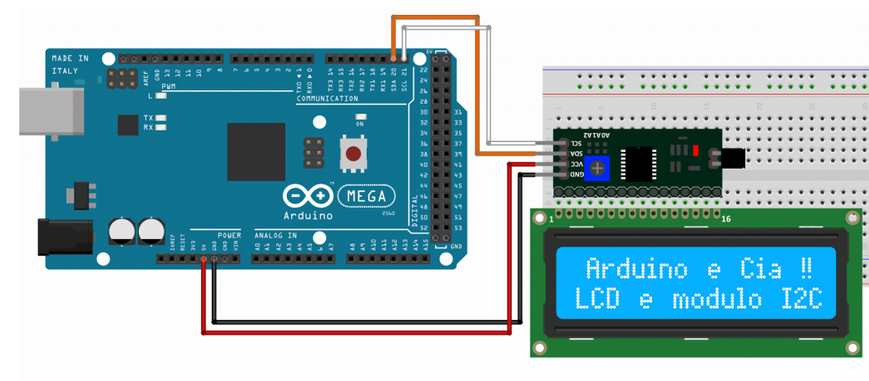

# Teste do Display LCD 16x2

Para utilização do Display LCD 16x2 é necessário utilizar uma biblioteca própria para ele, que possui funções para inicializa-lo, configurar os pinos para comunicação I2C, entre outras funções. Nesse teste será escrito frases e mensagens e exibidos no Display LCD 16x2 via comunicação I2C

# Montagem do Circuito

# Código

~~~C
//Programa: Display LCD 16x2 e modulo I2C
//Autor: Arduino e Cia

#include <Wire.h>
#include <LiquidCrystal_I2C.h>

//Inicializa o display no endereco 0x27
LiquidCrystal_I2C lcd(0x27,16,2);
 
void setup()
{
 lcd.init();
}
 
void loop()
{
  lcd.setBacklight(HIGH);
  lcd.setCursor(0,0);
  lcd.print("Arduino e Cia !!");
  lcd.setCursor(0,1);
  lcd.print("LCD e modulo I2C");
  delay(1000);
  lcd.setBacklight(LOW);
  delay(1000);
}
~~~

Código retirado do site [Arduino e Cia](https://www.arduinoecia.com.br/modulo-i2c-display-16x2-arduino/)
