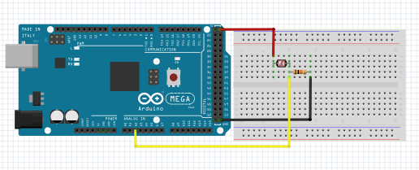

# Teste do Sensor de Luminosidade LDR

Para analisar a variação da reistência do LDR de acordo com a luz ele é conectado em serie a um resistor de 10k, assim, por meio do pino analógico será possível ler a variação da tensão gerada por ele. Nesse exemplo apenas é exibido a leitura do pino analógico no monitor serial

# Montagem do Circuito

# Código

~~~C
#define LDR  A2  //Pino digital onde está o LDR             
                      
 
void setup()
{
 Serial.begin(9600); //Inicializa o monitor serial     
}
 
void loop()
{
  //Lê o valor no pino analógico e armazena na variável
  int valorLuz = analogRead(LDR);
  //Exibe no monitor serial a menasagem     
  Serial.println("Luminosidade:");
  //Exibe o valor lido no monitor serial   
  Serial.println(valorLuz);
  //Intervalo de 1s
  delay(1000);                   
}
~~~
