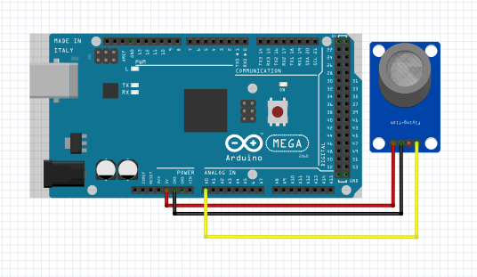
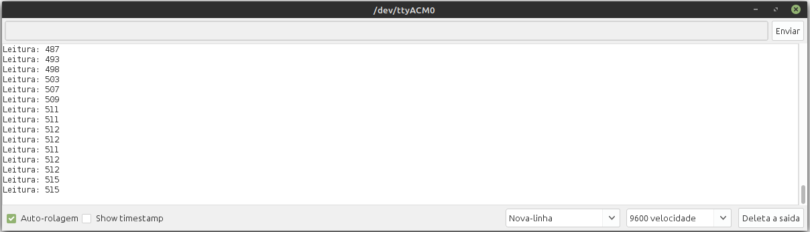

# Teste do Sensor de Gás MQ2

O sensor  de gás MQ2 será conectado a um pino analógico e por meio da função analogRead() será possível obter a quantidade gás lida pelo sensor. Esse valor será exibido no Monitor Serial do Arduino

# Montagem do Circuito

# Código

~~~C
#define MQ2 A0 //Pino anlógico utilizado pelo sensor de gás

void setup() {
  pinMode(MQ2, INPUT); //Define o pino como entrada
  Serial.begin(9600);  //Inicializa o monitor serial
}
void loop() {
  int valor_analogico = analogRead(MQ2); //Variável recebe o valor lido no pino analógico
  Serial.print("Leitura de gas: "); //Exibe texto no monitor serial
  Serial.println(valor_analogico);// Mostra no monitor serial o valor lido
  delay(100); //Intervalo de 100ms
}
~~~

Após liberar o gás do esqueiro aparece a leitura no Monitor Serial do Arduino aumentando

