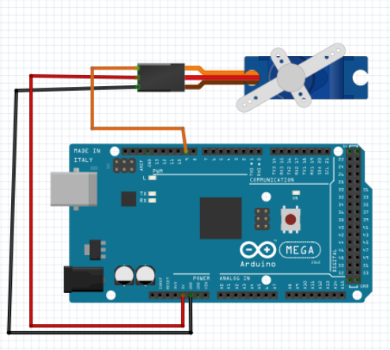

# Teste do Motor Servo MG995 

O Servo MG995 utilizado pode girar 180°. Porém, necessita ser ligado com uma fonte externa pois o arduino não suporta o consumo de corrente do servo. Para isso foi ligado uma fonte de 5V no servo e o negativo da fonte é ligada no negativo do arduino. 

Para utilização de Servo Motores no Arduino, há uma biblioteca que deve ser incluída e que permite controlá-los de forma simples, enviando o ângulo desejado por meio de uma função.

# Montagem do Circuito

# Código

~~~C
#include <Servo.h> //Inclusão da bibliotéca necessária

#define SERVO 9 //Pino digital utilizado pelo servo

Servo s; //Objeto do tipo servo
int pos; //Posição do servo

void setup () {
  delay(2000);
  s.attach(SERVO); //Associação do pino digital ao objeto do tipo servo
  s.write(0); //Inicia o motor na posição 0°
}
void loop() {
 /*Incrementa a variável "pos" de 10 a 170*/
  for (pos = 10; pos <= 170; pos++) { 
    s.write(pos); //Escreve o valor da posição que o servo deve girar
    delay(50); //Intervalo de 15ms
  }
  delay(1000); //Intervalo de 1s
  /*Decrementa a variável "pos" de 170 a 10*/
  for (pos = 170; pos >= 10; pos--) { 
    s.write(pos); //Escreve o valor da posição que o servo deve girar
    delay(50); //Intervalo de 15ms
  }

}
~~~
