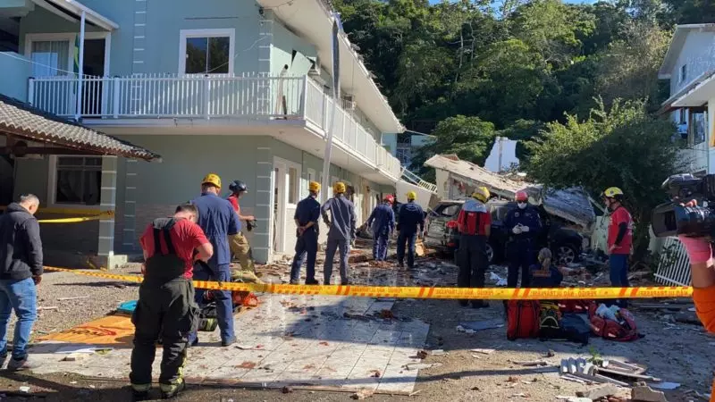
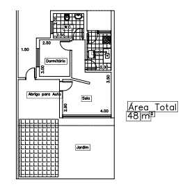

# Concepção do Projeto

Recentemente uma explosão por vazamento de gás aconteceu no bairro Jurerê deixando os moradores daquele local gravemente feridos. Este não é o primeiro, nem o último acontecimento de explosão por vazamento. Como toda tecnologia disponível a nosso favor, como podemos deixar isso acontecer? Vidas perdidas e pessoas feridas por erros humanos. 

Faço esse questionamento com o intuito de mostrar que é extremamente necessário utilizar a tecnologia para melhorar nossa qualidade de vida, para nos proporcionar mais segurança, e por mais simples que seja, um acidente desse nível poderia ser evitado facilmente com a utilização do conceito "Domótica". A pergunta que não quer calar... Como?
> Esse problema poderia ser evitado com um simples monitoramento de gás com um sensor. Caso tivesse sinal de vazamento, o sensor avisaria aos moradores para evacuar o local e poderiamos utilizar um módulo de conexão com a internet para fazer a comunicação com as autoridades competentes o mais rápido possível para aquele local.

Isso é só um exemplo do que pode ser feito e do que poderia ser evitado automatizando a casa. Trazendo **Segurança, conforto e praticidade**

Para este projeto, será realizada a construção de um protótipo de casa com o objetivo de Automatizá-la e mostrar diversos tipos de tecnologia integrada para trazer mais comodidade, praticidade e segurança para o indivíduo.

# Planta da Casa

Neste projeto, será implementado um sistema de automação (Domótica) para proporcionar conforto, segurança e praticidade em tarefas diárias. Com base nisso, veja a seguir o planejamento de instalação:

* Controle remoto das luzes da casa - O usuário poderá controlar as luzes de todos os cômodos remotamente;
* Sensor para vazamento de gás - Haverá um sensor de gás para evitar futuras explosões por vazamento de gáses inflamáveis;
* Lâmpadas inteligentes - Serão LED's com sensores de luminosidade (LDR) no jardim para serem acionadas automaticamente sempre que anoiteça ou desligadas sempre quando amanhecer;
* Portão eletrônico - Será instalado um motor servo para fazer a abertura e fechamento do portão de garagem remotamente; 
* Sensor de Temperatura - Terá no painel central um display que mostrará toda a interface do sistema, e nele, haverá a temepratura ambiente;

