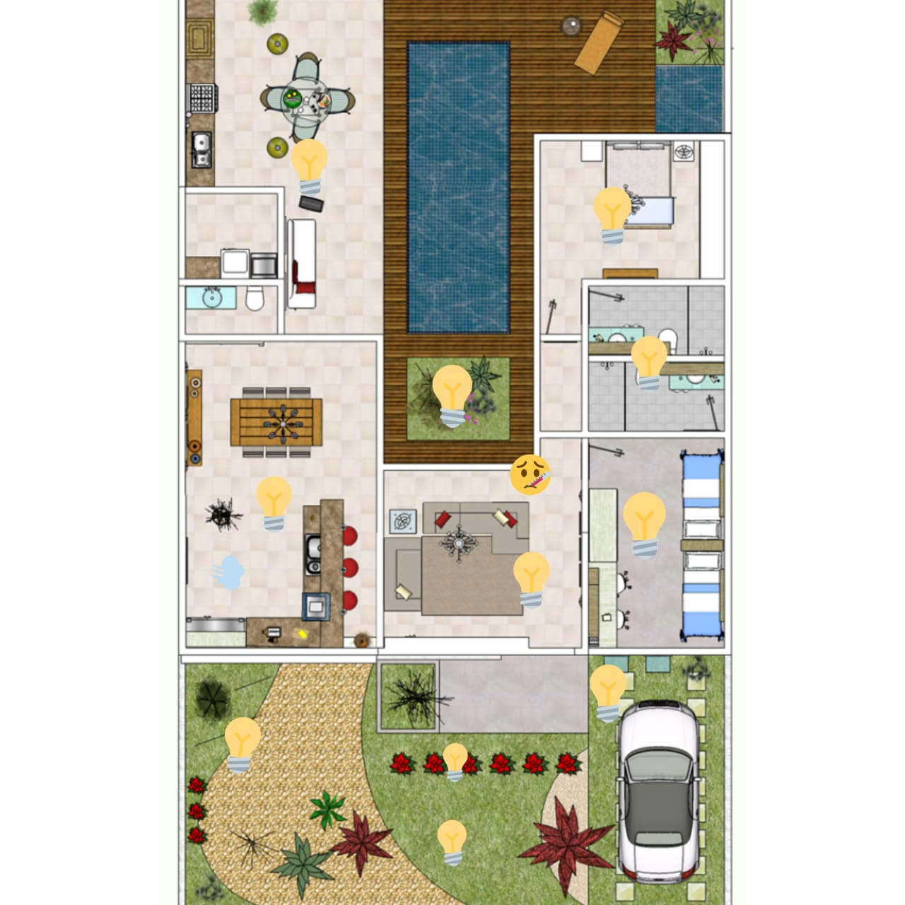

# Concepção do Projeto

Recentemente uma explosão por vazamento de gás aconteceu no bairro Jurerê deixando os moradores daquele local gravemente feridos. Este não é o primeiro, nem o último acontecimento de explosão por vazamento. Com toda tecnologia disponível e a nosso favor, como podemos deixar isso acontecer? Vidas perdidas e pessoas feridas por erros humanos. 

Faço esse questionamento com o intuito de mostrar que é extremamente necessário utilizar a tecnologia para melhorar nossa qualidade de vida, para nos proporcionar mais segurança, e por mais simples que seja, um acidente desse nível poderia ser evitado facilmente com a utilização do conceito "Domótica". A pergunta que não quer calar... Como?
> Esse problema poderia ser evitado com um simples monitoramento de gás com um sensor. Caso tivesse sinal de vazamento, o sensor avisaria aos moradores para evacuar o local e poderiamos utilizar um módulo de conexão com a internet para fazer a comunicação com as autoridades competentes o mais rápido possível para aquele local.

Isso é só um exemplo do que pode ser feito e do que poderia ser evitado automatizando a casa. Trazendo **Segurança, conforto e praticidade**

Para este projeto, será realizada a construção de um protótipo de casa com o objetivo de Automatizá-la e mostrar diversos tipos de tecnologia integrada para trazer mais comodidade, praticidade e segurança para o indivíduo.

---
# Planta da Casa

###### Legenda:
* 💡 LEDs 
* 💨 Sensor de Gás
* 🤒 Sensor de Temperatura

---
# Objetivos

Neste projeto, será implementado um sistema de automação (Domótica) para proporcionar conforto, segurança e praticidade em tarefas diárias. Com base nisso, veja a seguir o planejamento:

* Controle remoto das luzes da casa - O usuário poderá controlar as luzes de todos os cômodos remotamente;
* Sensor de gás - Haverá um sensor de gás para evitar futuras explosões por vazamento de gáses inflamáveis;
* Lâmpadas inteligentes - Serão LED's com sensores de luminosidade (LDR) no jardim para serem acionadas automaticamente sempre que anoiteça ou desligadas sempre quando amanhecer;
* Portão eletrônico - Será instalado um motor servo para fazer a abertura e fechamento do portão remotamente; 
* Sensor de Temperatura e Umidade - Terá no painel central um display que mostrará toda a interface do sistema, e nele, haverá a temperatura e umidade ambiente.
* Sensor de Movimento - Será instalado um sensor de movimento dentro da garagem para detectar quando algum automóvel sair e fazer o acionamento do portão automaticamnete

---
[**Design**](./design.md)
