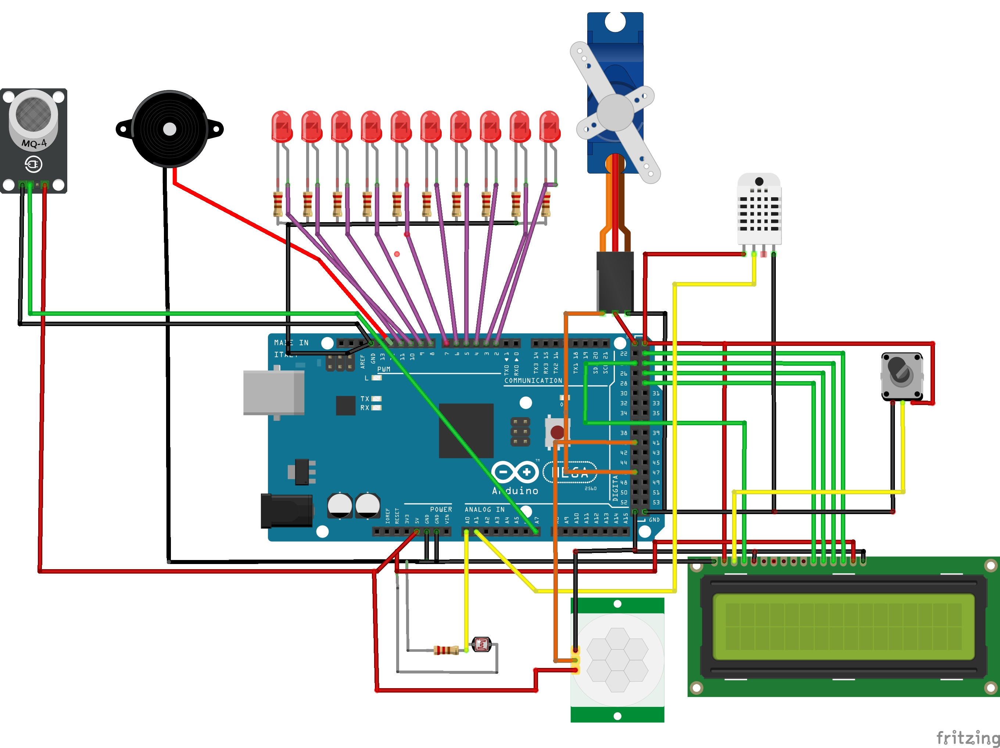

# Design

Nesta etapa foi pensado e planejado em um esquema elétrico e em seus respectivos componentes para compôr o circuito.

---
### Tabela de componentes 

Componente   | Quantidade
--------- | ------
LED | 10
Motor Servo MG995| 1
Módulo Buzzer 5V | 1
Sensor de Gás MQ2 | 1
Sensor de Movimento Presença PIR | 1
Resistor 330R | 10
Resistor 10K | 1
Arduino Mega 2560 | 1
Display LCD 16x2 |   1
Sensor de Temp. & Umi. DHT11 |   1
LDR | 1

---
### Maquete Eletrônica

Para a criação da maquete eletronica foi utilizado o software *Fritzing*. A partir dele foi criado o seguinte esquemático:

###### Figura 1 - Maquete eletrônica.

* O Display LCD 16x2 foi ligado por meio de comunicação I2C, ou seja, usa-se apenas 4 pinos nos quais são: SDA (pino 20), SCL(pino 21), GND e VCC
* O buzzer do esquemático é um PNP, ou seja, usa-se 3 pinos nos quais são: IO (pino 12), GND e VCC
* O potenciômetro no esquemático não foi utilizado por conta do módulo I2C imbutido no Display LCD 16x2 que contém um ajuste do BackLight

# Testes dos Componentes

Depois de definirmos os componenetes, é necessário entender o funcionamento e realizar os testes de cada item separadamente. 

A programação é realizada por meio da [IDE Arduino](https://www.arduino.cc/en/software) e antes de executar os códigos é preciso selecionar o modelo da placa que será utilizado, nesse caso Arduino Mega 2560. Nos links abaixo serão descritos como foi feito os testes de cada parte do projeto:

* [LEDs](./Testes/LEDs.md)
* [Motor Servo MG995](./Testes/servo.md)
* [Buzzer](./Testes/buzzer.md)
* [Sensor de Temperatura e Umidade DHT11](./Testes/dht.md)
* [Sensor de Luminosidade LDR](./Testes/ldr.md)
* [Sensor de Presença PIR](./Testes/PIR.md)
* [Sensor de Gás MQ2](./Testes/mq2.md)
* [LCD 16x2](./Testes/lcd.md)

Precisamos tomar alguns cuidados para que tudo funcione adequadamente como um sistema com diversas tarefas sendo executadas ao mesmo tempo. Para exemplificar, a técnica de multitarefas que será utilizada foi disponibilizada pelo professor e tem como o código abaixo e demostra como temporizar duas tarefas simples de piscar LED:

* [Exemplo Multitarefas](./Testes/multitarefas.ino)

O Monitor Serial é uma das ferramentas mais poderosas e necessária para executarmos todas as funções, pois ele torna possível transmitir ou ler informações na forma de texto. Ele será fundamental para a construção do projeto, pois por meio dele o usuário poderá se comunicar com o produto, exibindo dados e mensagem sobre o sistema na tela do computador e recebendo via teclado todos os comandos para executar tarefas. Para exemplificar, o professor disponibilizou um código de base para testarmos seu funcionamento. Foi criada uma aplicação para acender e apagar 3 LEDs utilizando os números de 1 a 3 do teclado. Cada LED muda seu estado atual quando for enviado o número correspondente a ele para o Monitor Serial:

* [Exemplo Monitor Serial](./Testes/monitorserial.ino)

# Referências

* [Fritzing](https://fritzing.org/)
* [Tutorial Arduino LPAE](https://github.com/LPAE/arduino_tutorial)
* [Utilizando LDR](https://www.filipeflop.com/universidade/kit-maker-arduino/projeto-10-sensor-de-luz-ambiente/)
* [Utilizando DHT11](https://www.filipeflop.com/produto/sensor-de-umidade-e-temperatura-dht11/) 
* [Utilizando Sensor de Gás MQ2](https://blogmasterwalkershop.com.br/arduino/como-usar-com-arduino-sensor-detector-de-gas-inflamavel-fumaca-mq-2)
* [Utilizando Servo Mototr](https://blogmasterwalkershop.com.br/arduino/como-usar-com-arduino-servo-motor-mg995)
* [Utilizando LCD 16x2 I2C](https://www.arduinoecia.com.br/modulo-i2c-display-16x2-arduino/) 
* [Utilizando Sensor de Presença PIR](https://www.filipeflop.com/blog/acendendo-uma-lampada-com-sensor-de-presenca/)

---
[**Implementação**](./implementacao.md)
