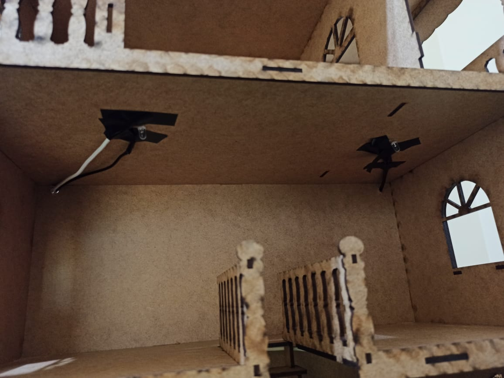
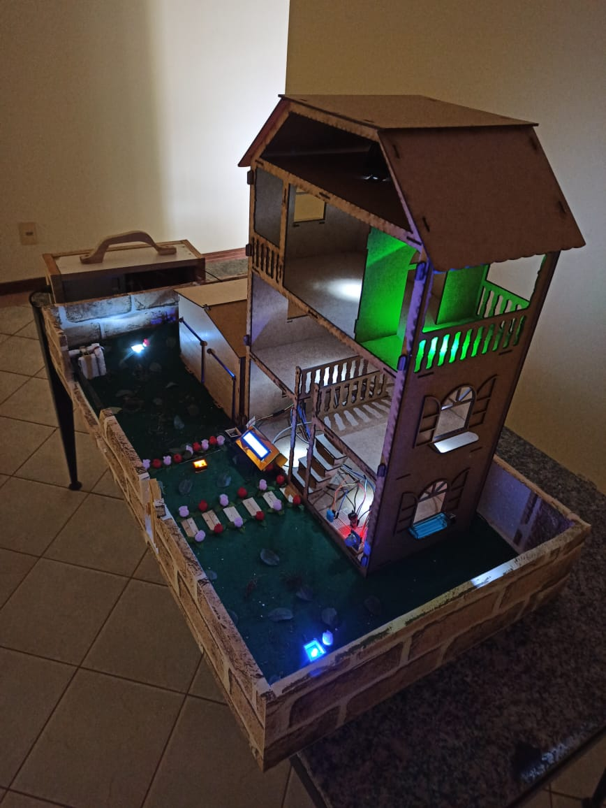

# Implementação

Nesta etapa iremos iniciar a montagem do projeto de automatização residencial, ela irá receber todas as tecnologias baseando-se na estrutura apresentada e projetada na etapa do Design. 

# Fabricação da maquete

Na etapa da concepção foi apresentada a planta baixa da casa em questão, porém, foi apenas uma ideia inicial. 
A maquete em si foi feita a partir de placas de isopor para fazer a base onde será montado o jardim e o terreno da casa. A casa foi projetada em MDF e cortada à laser, na qual decidi fazer três andares e uma garagem separada com portas. Além disso os outros materiais para decoração foram utilizados EVAs e papel adesivo.

Alguns componentes estarão localizados no cômodo da cozinha e sala, como o sensor de gás, sensor de temperatura e umidade, buzzer e display lcd. Portanto para ser possível a visualização e testes serão instalados no primeiro andar. O arduino ficará localizado na região atrás da garagem e os fios de conexão levarão os componentes aos seus locais definidos.

# Montagem

A primeira parte da montagem da maquete era fazer um terreno grande para construir a infraestrutura da casa. Para isso, foram utilizadas duas placas de isopor para fazer a base do terreno e os muros.

Após montada a base, partiremos para montagem da casa e da garagem em MDF.

Depois disso, a casa foi colocada no isopor para marcar o quanto de EVA texturizado precisariamos

Nessa etapa, foi cortada a folha em EVA e colocada sob o isopor para começarmos a montar todo o terreno

Foi colado um papel texturizado de tijolo ao redor de todo o muro do terreno

Utilizamos a folha em EVA para fazer a grama e para passar os fios por baixo, escondendo assim, parte da fiação do jardim, dos sensores e do motor servo

Na garagem, foi feita uma perfuração na parte de trás para passagem de alguns fios e também, a instalação do LED e do Sensor de Movimento PIR

Na casa principal foram feitas muitas perfurações nas partes traseira e lateral para passagem de fios e instalação dos LEDs nos cômodos

Os sensores de Gás, Temperatura e Umidade, Buzzer e o Display LCD 16x2 foram posicionados na parte da cozinha e sala no primeiro andar. Pois facilita o acesso para realizar testes de funcionamento e até mesmo na manutenção.

Após realizadas todas as ligações da maquete, foram feitos inúmeros testes de funcionamento. Concluindo que está tudo funcionando perfeitamente!

---
# Código Principal

Para acessar o meu código [**Clique aqui**](./Codigos/THE_HOUSE_CARIOCA.ino)

---

# Funcionamento do Sistema Principal

Na etapa anterior, foram realizados os testes individuais de cada componente. Agora, precisamos integrar todas as funcionalidades para que interajam de forma correta. Vale lembrar que as tarefas serão escalonadas na função loop, utilizando o métopo de multitarefas exemplicado no design. A baixo serão detalhadas cada tarefa, e seu respectivo funcionamento:

### Função Setup

A função setup executa uma série de comandos para inicializar a comunicação com os módulos e sensores, além disso, já realiza a configuração dos pinos de entrada e saída de cada componente. Ela é executada somente uma única vez.

### Função Loop

A função loop é responsável por chamar diversas outras funções que são as responsáveis para a execução do conjunto de tarefas do sistema. Para melhor explicação, essa parte da execução do código foi divida em cinco etapas que são executadas de forma conjunta:

   * acender_luz - Responsável por acionar a luz de entrada conforme a detecção das letras do teclado do computador. O programa verifica constantemente se existe alguma entrada serial disponível e se ele recebeu o caractér específico. Caso positivo, ocorre a execução da tarefa responsável por acionar ou apagar as luzes dos cômodos. Caso negativo, ele volta a verificar se a portal serial está disponível e recebendo algum dado. Esse bloco possui uma temporização independente.
   
   * sensor_temperatura_umidade - Responsável por medir a temperatura e umidade, esse bloco funciona da seguinte maneira: Primeiro ele mede a temperatura e umidade, armazenas os valores lidos em variáveis distintas, aguarda 100 milisegundo e envia as informações armazenadas para o Display LCD 16x2. Esse bloco possui uma temporização independente.
   
   * sensor_movimento - Responsável pelo sistema de detecção de movimento. O programa realiza uma leitura dos valores do sensor PIR, tais como Alto ou Baixo. Caso o valor seja Alto, o sensor é acionado e então ocorre a execução do sinal sonoro, o servo motor abre a cancela do portão e no display lcd recebe uma mensagem dizendo que um veículo está saindo. Caso negativo, ele realiza uma nova leitura. Esse bloco possui uma temporização independente.
   
   * sensor_gas - Responsável pelo sistema de vazamento de gás. O programa realiza uma leitura dos valores de concentração de gases e fumaça que o sensor MQ-2 envia. Caso o valor atinga uma quantidade significativa, o sensor é acionado e então ocorre a execução do sistema de segurança: É desligado todas as luzes e aberto a cancela do portão para evacuamento, além de tocar uma sirene alertando sobre o vazamento junto com uma mensagem no display lcd dizendo que está vazando gás. Caso negativo, ele aguarda e realiza uma nova leitura. Esse bloco possui uma temporização independente.
   
   * jardim - Responsável por acionar a luzes do jardim conforme a detecção de luminosidade verificada pelo LDR. O programa verifica constantemente se os valores analógicos do sensor de luminosidade não for atingido em um nível específico de luz, ele é ativado e executa a ação de ligar os LEDs do jardim. Caso estiver muito claro, ou seja, acima do nível limite de luz, ele apaga todas as luzes do jardim e verifica para quando o sensor for excitado por uma grande quantidade de luz. Esse bloco possui uma temporização independente. Esse bloco possui uma temporização independente.

É importante ressaltar que, após a execução das tarefas referentes dentro da função loop, a mesma retorna ao estado de leitura inicial completando o ciclo.

Por meio destas ações foi possível concluir que todo o sistema funciona corretamente, cumprindo com o que foi planejado nas etapas anteriores de concepção e design.

---

[**Operação**](./operacao.md)
