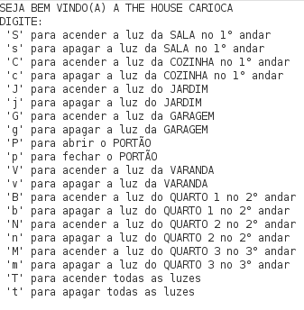

# Operação

Durante as etapas anteriores, foi descrito todo o processo de construção do projeto para que fosse possível chegar a essa última etapa da abordagem CDIO. 
As intruções e modo de operação do sistema serão descritas e demonstradas nessa etapa.

### Manual

Para a inicialização do sistema, conecta-se o Arduino ao computador via USB e por meio da IDE do Arduino faz-se a compilação do código fonte do sistema. A comunicação com o usuário é realizada pelo monito serial do Arduino, no qual serão exibidas as mensagens de comando enviados pelo teclado. As teclas de controle e suas respectivas ações são exibidas a seguir:

Cada tecla é responsável por ligar/desligar alguma parte do sistema.

Como podemos verificar, o objetivo principal do trabalho foi alcançado. A aplicação de diversas tecnologias com o intuito de automatizar a residência foi concluido! 

### Erros e Problemáticas

Como todo protótipo, o produto uma vez que é atendido o seu objetivo geral, está passível de erros e questões problemáticas secundárias. 
* Um dos problemas encontrados foi a "tremedeira" do motor servo e sua instabilidade. Não afeta o funcionamento principal, mas a angulatura as vezes fica alterada sozinha e depois quando reinicio volta.
* Outro ponto são as luzes do jardim. Quando aperto para desligá-las ignoram o comando por conta do LDR e ficam ligando ou desligando, independente dos comandos que eu faça no monitor serial

### Melhorias Futuras

* Pretendo levar esse sistema para meu apartamento e melhorar algumas lógicas de programação como por exemplo os leds do jardim, o sistema de segurança de vazamento de gás
* Pretendo integrar o sistema da Alexa no meu sistema e fazer uma super automação

---
# Vídeo

Nesta seção está disponível um vídeo para apresentação dos resultados finais da maquete.

Clique no link abaixo para assistir o vídeo:

  https://youtu.be/6-qCfZjGBUk
